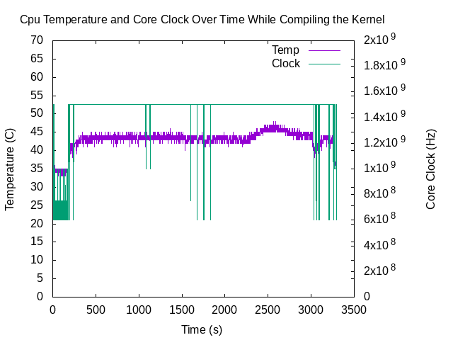

#Kernel compiling performance report

As the system starts monitoring, the first 250 seconds were spent checking out git repos, downloading and getting everything ready for compiling the Kernel. It can be seen from the graph that this process did not use much CPU resources with the CPU clock fluctuating between 600Mhz and 700Mhz. This resulted in a low average temperature of around 35 degrees Celcius during this period. As soon as the Kernel was being compiled, the CPU core ramped up to its (factory) maximum clock of 1.5Ghz and rarely fluctualted for the rest of the compiling run. However, thanks to the aluminum chassis around the Pi and a case fan blowing cool air through it, core temperature stayed warm at an average of 44 degrees, which is only 9 degrees higher than idle (small load) temperature. Core temperature saw a steady rise by 1-2 degrees 2200 seconds in (~36 minutes) possibly because of higher CPU utilisation or change in ambient (room) temperature (I have an automated heater so was not sure if it turned on by itself that affected CPU Temp). Peak temperature of aproximately 46 degrees C was hit after about 2600 seconds (~43 minutes) then the system cooled back down to a slightly higher under-load temperature of 45 degress at its 50 minutes mark. The last part of this run includes backing-up /root folder, copy new Kernel to its location and instaling drivers, etc., which explains the changing core clocks and temperature as seen in the graph. Overall, it is clear that the Pi handled the job well with core Temperature staying well under 50 degrees C and no sign of CPU Throttling. 
